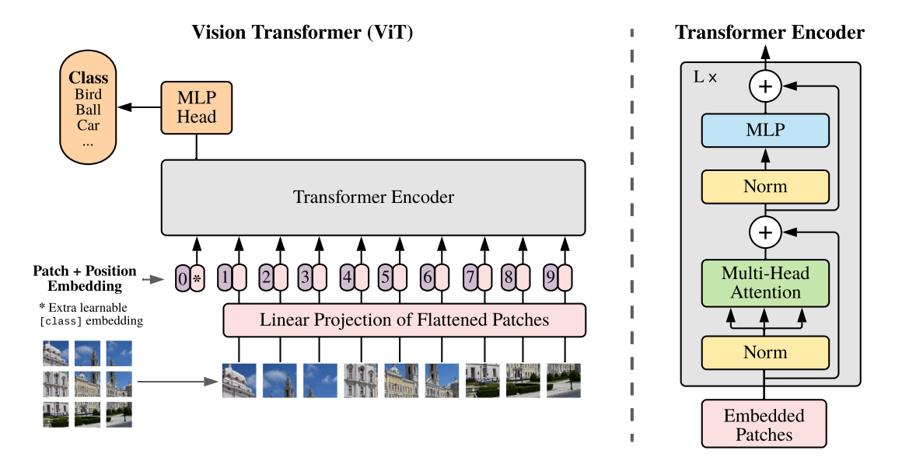

# Vision Transformer
> In vision, attention is either applied in conjunction with convolutional networks, or used to replace certain components of convolutional networks while keeping their overall structure in place. We show that this reliance on CNNs is not necessary and ***a pure transformer*** applied directly to sequences of image patches can perform very well on image classification tasks. 

&emsp;&emsp;我 ViT 今天就是要给 Tranformer 正名！（指只用个 encoder 的屑 pure transformer ...）  

## 一、Method
&emsp;&emsp;直接上结构：  

&emsp;&emsp;我们只需要理解一个核心的问题：NLP 处理的语言数据是序列化的，而CV 中处理的图像数据是三维的（height、width 和 channels）。如何将图像这种三维数据转化为序列化的数据？  
&emsp;&emsp;之前有文章直接将每个像素作为一个 token，显然会 TLE。本文处理方法是将图像被切割成一个个 patch，这些 patch 按照一定的顺序排列，就成了序列化的数据。这就是 ViT 的精髓所在。（你可能会说 就这？我的评价是细节非常多）